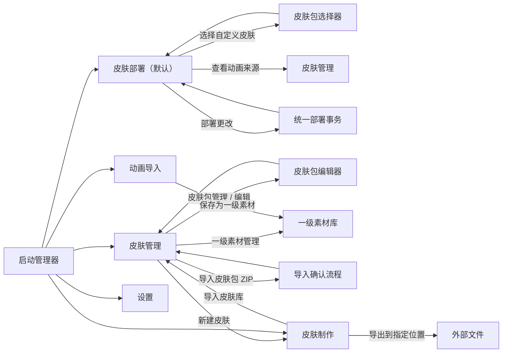

# The Bazaar 皮肤管理器 1.2.0 产品与 UI 交互规格

状态：最终意见已合入，可进入开发
适用版本：1.2.0 交互重构
文档优先级：本文件是 1.2.0 的唯一产品与交互依据；评审通过前不开始 UI 开发。

## 1. 文档目的

这次重构不从现有页面继续打补丁，而是从用户要完成的工作反推产品对象、页面和操作。

文档需要回答以下问题：

1. 用户手里究竟管理什么对象；
2. 每个功能为什么存在，属于哪个页面；
3. 哪些旧入口重复、误导或没有必要，应当移除；
4. 用户从哪里进入，点击什么，输入什么，系统产生什么结果；
5. 计划状态、实际部署状态、素材文件和游戏原版之间如何区分；
6. 空状态、异常状态、危险操作和旧数据迁移如何处理；
7. 完成到什么程度才算 1.2.0 可发布。

## 2. 核心约束

### 2.1 产品目标

皮肤管理器必须让普通用户完成四件事：

- 看见自己拥有的皮肤包和一级素材；
- 把某个皮肤包映射到一个或多个游戏原皮肤；
- 一次性部署当前配置，或恢复游戏原版；
- 启动游戏并明确知道当前实际生效的状态。

它还必须让制作者完成三件事：

- 从人物、背景、小图标等一级素材制作皮肤包；
- 编辑、验证、导入、导出和删除皮肤包及一级素材；
- 在确有需要时制作和管理目标相关的 Spine 动画替换。

### 2.2 不可破坏的工程约束

- 服务器对客户端替换无感知；部署仍然只改本地资源和加载配置。
- 皮肤包不永久绑定职业。职业和原皮肤选择属于部署映射。
- 同一皮肤包可以映射到多个职业皮肤，部署时按目标适配器生成临时运行包。
- 未提供的槽位继续使用游戏原版资源。
- 只有经过验证的适配器才能进入正式部署事务。
- 游戏更新、资源哈希变化或适配器失效时，不允许静默部署。
- 所有部署和取消部署仍走统一事务，不能由制作器、编辑器各写一套部署逻辑。

### 2.3 UI 约束

- 最低可用窗口为 1024×640；125% 和 150% Windows 缩放下主要按钮仍可见。
- 工具栏、底部操作栏和危险操作区使用固定布局，不与用户输入的文本争抢宽度。
- 内容区独立滚动；不允许通过扩大整个页面来“放下”新增控件。
- 名称、ID、版本和路径必须限制显示长度；完整内容通过悬浮提示或详情区查看。
- 不能只靠红绿颜色表达状态，必须同时有图标或文字。
- 所有破坏性操作必须说明影响范围并二次确认。

## 3. 用户角色与主要任务

| 角色 | 高频任务 | 低频任务 |
| --- | --- | --- |
| 普通使用者 | 切换皮肤、启用/停用、部署、恢复原版、启动游戏 | 导入别人分享的 ZIP |
| 皮肤制作者 | 组合一级素材、预览、微调、保存到皮肤库 | 编辑槽位、导出分享、管理一级素材 |
| 高级制作者 | 管理音频、检查兼容性、查看日志 | 制作 Spine 动画替换、处理迁移和冲突 |

默认页面和导航优先级按使用频率排列，不能让普通使用者先经过制作或导入流程。

## 4. 产品对象模型

### 4.1 一级素材 `LibraryAsset`

一级素材是用户可单独保存、复用和管理的原始或派生资源。它不因某个皮肤包被删除而自动消失。

一级素材包括：

- 用户输入的人物原图、背景原图、图标生成原图；
- 用户直接导入的小图标及生成器产生的小图标；
- 单张经过抠底、缩放、裁切或偏移处理的派生图像；
- 导入的 Spine 骨骼、图集、纹理和动画组合；
- 可复用音频源；
- 来源、作者、许可说明、文件哈希、创建时间和被哪些皮肤包引用。

一级素材有自己的 ID、名称、类型、预览和文件所有权。皮肤包通过引用使用一级素材；删除仍被皮肤包引用的一级素材时必须阻止或要求先解除引用。

### 4.2 皮肤包 `SkinPack`

皮肤包是可部署的组合配方，不是部署目标。它包含：

- 稳定的皮肤包 ID；
- 显示名称、版本、作者和说明；
- 封面图；
- 图像槽位到一级素材/生成结果的引用；
- 音频一级素材及其路由元数据；
- 可选的 Spine 一级素材引用；
- 制作来源和生成配方；
- 内容完整性和能力摘要。

皮肤包不包含：

- 当前职业；
- 当前皮肤；
- 启用状态；
- 已部署状态。

没有显式封面时，按以下顺序确定封面：

`store_image` → `collection_list` → `hero_select` → `portrait_gameplay` → 第一张可读取图片 → 占位图。

### 4.3 部署分配 `DeploymentAssignment`

部署分配表示“某个自定义皮肤包准备替换哪个游戏原皮肤”。它包含：

- 职业；
- 被替换皮肤；
- 选中的皮肤包，可为空；
- 是否启用；
- 皮肤包所引用的可选 Spine 一级素材；
- 当前计划与实际安装之间的差异。

同一个皮肤包可以出现在多个部署分配中。修改部署分配绝不能回写皮肤包的职业字段。

### 4.4 已安装快照 `InstalledSnapshot`

这是磁盘上当前实际生效的部署结果，来源于上一次成功事务。它和界面中尚未点击“部署更改”的计划必须分开显示。

### 4.5 制作草稿 `GeneratorDraft`

制作草稿保存人物、背景、小图标等一级素材引用，以及抠底参数、全局偏移和单项偏移。草稿不是皮肤包，也不能部署。只有完成生成并通过校验后，才产生皮肤包或外部交付物。

### 4.6 Spine 动画素材 `SpineAsset`

Spine 动画素材是一级素材的一种，保存骨骼、图集、纹理、动画片段、预览参数和目标兼容性。它通过“动画导入”产生，通过“皮肤管理 → 一级素材管理”统一查看、编辑元数据、删除和检查引用。

### 4.7 分发归档 `DistributionArchive`

ZIP 只是导入和分享的传输格式，不是需要单独管理的页面对象。一个 ZIP 可以包含：

- 一个皮肤包；
- 皮肤包引用的一级素材，包括可选 Spine 动画素材；
- 清单、校验信息和版本兼容声明。

### 4.8 临时运行包 `MaterializedRuntimePack`

部署时，管理器把皮肤包、一级素材和目标适配器合成目标相关的临时运行包。它不进入皮肤包库，也不能由用户直接编辑。

### 4.9 文件所有权和默认路径

| 对象 | 默认位置 | 谁可以删除 | 是否直接部署 |
| --- | --- | --- | --- |
| 内嵌制作草稿 | 管理器用户数据目录的 `drafts` | 管理器 | 否 |
| 一级素材 | 管理器用户数据目录的 `assets/<asset-id>` | 管理器，需检查引用 | 否 |
| 内嵌制作生成的皮肤包 | 管理器用户数据目录的 `skin-packs/<pack-id>` | 管理器，需确认 | 否 |
| 外部工作区引用 | 用户原路径 | 管理器只能移除索引 | 否 |
| 导入 ZIP 的皮肤包 | 管理器用户数据目录的 `skin-packs/<pack-id>` | 管理器，需确认 | 否 |
| Spine 动画素材 | 管理器用户数据目录的 `assets/<asset-id>` | 管理器，需检查引用 | 否 |
| 临时运行包与备份 | 管理器部署目录 | 统一部署事务 | 是 |

嵌入管理器后的皮肤制作功能不再把正式皮肤包默认写到 EXE 目录。EXE 目录可能只读，也无法表达皮肤库所有权。独立便携版生成器如果继续作为开发工具保留，仍可按其原规则输出到 EXE 所在目录；该行为不属于 1.2.0 正式用户流程。

## 5. 信息架构

一级导航固定为五项：

1. **皮肤部署**：默认页面；管理皮肤包到游戏皮肤的映射、实际状态和统一部署事务。
2. **皮肤管理**：包含“皮肤包管理”和“一级素材管理”两个子界面。
3. **皮肤制作**：内嵌确定性制作器；可以导入皮肤库，也可以导出到指定文件位置。
4. **动画导入**：导入和校验 Spine 动画，保存为一级素材。
5. **设置**：游戏位置、Steam 启动、数据目录、更新与高级诊断设置。

不再保留：

- 一级“资产包导入”页面；
- 普通皮肤包编辑器里的“骨骼/动画”标签；
- 仅用于启动外部 EXE 的“皮肤制作器”页面；
- 制作完成后的“导入 Skin Manager”“部署并运行 Doctor”“从头运行全部”；
- 导入皮肤包时填写职业；
- 制作皮肤包时填写职业；
- 普通模式下的“添加现有工作区”。

“导入皮肤包 ZIP”属于“皮肤管理 → 皮肤包管理”工具栏；“编辑内容”是从某张皮肤包卡片进入的上下文页面，不占一级导航。小图标、原图、Spine 动画等内部对象统一进入“皮肤管理 → 一级素材管理”。



## 6. 全局框架

### 6.1 顶部区域

左侧：

- 产品名；
- 当前版本；
- 一级导航。

右侧固定区域：

- 游戏目录/适配器总体状态；
- 当前实际状态，例如“原版 / 未部署”“已部署 3 个目标”“需要修复”；
- “启动游戏”主按钮；
- 更多菜单：设置、打开日志目录、关于。

顶部状态不得被导航标题或皮肤包名称挤压。

“启动游戏”必须调用 Steam 启动协议或已验证的 Steam 启动方式，不能直接运行游戏 EXE。找不到 Steam 时显示可恢复错误，不得回退到已知无法正常工作的直接 EXE 启动。

### 6.2 通用页面状态

所有页面必须定义以下状态：

- 加载中：保留页面骨架，不弹阻塞窗口；
- 空状态：解释为什么为空，并提供唯一合理的下一步；
- 正常状态；
- 有未保存修改；
- 操作进行中：禁用重复提交，显示进度；
- 可恢复错误：原位提示并提供重试；
- 阻塞错误：明确阻塞原因和修复入口。

### 6.3 对话框规则

- 选择对象使用对话框或抽屉；编辑复杂内容进入完整页面。
- 普通成功不弹“确定”窗口，使用非阻塞通知。
- 错误对话框必须包含对象、失败阶段、原因和可执行的下一步。
- 删除、清空、覆盖和恢复原版必须二次确认。

## 7. 页面一：皮肤部署

### 7.1 页面职责

皮肤部署页负责创建“自定义皮肤 → 游戏原皮肤”的映射，并把全部计划一次性提交给统一部署事务。它是默认页面。

### 7.2 映射卡布局

每条映射必须以用户指定的方向呈现：

```text
皮肤部署                                  [刷新] [取消全部部署] [部署更改]
计划：2 条启用映射                         实际：1 条已生效
┌────────────────────────────────────────────────────────────────────┐
│  ✓  [自定义封面] 自定义皮肤 ▼  ─────→  [原皮封面] 默认皮肤 ▼  状态 │
│     蜥蜴与墙神 v0.4.0                   Dooley（默认皮肤）    已生效 │
├────────────────────────────────────────────────────────────────────┤
│  ✓  [自定义封面] 自定义皮肤 ▼  ─────→  [原皮封面] 默认皮肤 ▼  状态 │
│     琴音炼金术师 v0.9.62                Mak（默认皮肤）       待部署 │
└────────────────────────────────────────────────────────────────────┘
[＋ 添加皮肤映射]
```

左侧下拉框选择皮肤库中的自定义皮肤包；右侧下拉框选择游戏职业及其某一原皮肤。两个下拉框都必须同时显示图片、名称和版本/默认标记，不能退化为纯文字列表。

### 7.3 映射操作

- 勾/叉控制该映射是否启用；状态同时用颜色和文字表达。
- “添加皮肤映射”创建一条未完成映射，未选择两端时不能部署。
- 同一自定义皮肤可以映射到多个原皮肤。
- 同一个原皮肤同一时刻只能有一条启用映射；冲突时要求用户选择保留哪条。
- 删除映射只修改计划；如果实际仍已部署，状态变为“待取消”。
- 选择下拉项只修改计划，不立即写游戏文件。

### 7.4 下拉选择器

自定义皮肤选择器包含搜索、封面、名称、版本、内容摘要和目标兼容性；固定提供“未选择”和“去制作皮肤”。

原皮肤选择器按职业分组，显示职业图标、皮肤图片、皮肤名称、内部标识和“默认皮肤”标记。自动扫描到的新英雄和新皮肤在适配器尚未验证时仍可见，但标为“未适配”，不能部署。

### 7.5 状态定义

| 状态 | 含义 | 允许操作 |
| --- | --- | --- |
| 映射未完成 | 左右任一端未选择 | 补全或删除 |
| 待部署 | 计划启用，实际未安装 | 部署更改 |
| 已生效 | 计划与实际一致 | 切换、停用、删除计划 |
| 有待应用修改 | 任一端、启用状态或内容版本改变 | 部署更改、放弃计划 |
| 待取消 | 计划停用/删除，实际仍安装 | 部署更改 |
| 兼容性警告 | 部分组件继续使用原版 | 查看详情、部署兼容部分 |
| 已阻塞 | 适配器或游戏版本不安全 | 修复后重试 |
| 部署失败 | 上次事务失败并回滚 | 查看错误、重试 |

### 7.6 固定操作

- **刷新**：重新扫描游戏、职业、皮肤、适配器和实际快照，不丢计划。
- **取消全部部署**：确认后恢复全部原版，但不删除皮肤包和一级素材。
- **部署更改**：列出新增、替换、取消、兼容性降级和冲突，确认后执行统一事务。

## 8. 页面二：皮肤管理

皮肤管理包含两个固定子界面：“皮肤包管理”和“一级素材管理”。两者共享搜索方式和固定详情/操作区，但管理对象不同。

### 8.1 子界面：皮肤包管理

负责皮肤包的识别、组合、导入、导出和删除，不直接写游戏文件。

```text
皮肤管理  [皮肤包管理] [一级素材管理]
[搜索____________] [全部能力▼] [新建皮肤] [导入皮肤包 ZIP]
┌──────────────────────────────────────────────────────────────────┐
│ [封面]            [封面]            [封面]                       │
│ 名称               名称               名称                         │
│ v1.0 · 12图        v0.9 · 24音频       v0.4 · 12图                  │
│ 引用 4 个素材       引用 9 个素材       引用 5 个素材                 │
│ ...独立滚动...                                                    │
└──────────────────────────────────────────────────────────────────┘
选中：名称 · 版本 · 引用 · 使用状态 · 路径（省略）
                              [用于部署…] [编辑] [导出 ZIP] [删除]
```

卡片必须显示真实封面、最多两行名称、版本、内容摘要、一级素材引用数量和部署使用状态。路径只在详情显示。底部详情区和按钮区固定分栏，用户文本不能挤压按钮。

工具栏：

- 搜索名称、ID、作者；
- 按含图像、含音频、含动画、存在问题筛选；
- “新建皮肤”进入皮肤制作；
- “导入皮肤包 ZIP”只处理外部分发包。

选中包操作：

- **用于部署…**：进入皮肤部署并创建一条左侧已选中的映射；
- **编辑**：进入上下文皮肤包编辑器；
- **导出 ZIP**：把皮肤包及其被引用一级素材打包；
- **删除**：删除皮肤包，一级素材默认保留。

删除前检查计划和实际部署。当前实际已部署时必须先取消部署；只存在计划引用时，确认后同步清除计划。

### 8.2 子界面：一级素材管理

负责查看和管理人物原图、背景、小图标、图标生成源、派生图像、音频和 Spine 动画等内部资源。

```text
皮肤管理  [皮肤包管理] [一级素材管理]
[搜索____________] [全部类型▼] [导入普通素材] [打开素材目录]
┌──────────────────────────────────────────────────────────────────┐
│ [预览] 人物原图 │ [预览] 小图标 │ [预览] Spine │ [波形] 音频      │
│ 名称 / 类型      │ 名称 / 类型    │ 名称 / 目标    │ 名称 / 响度      │
│ 被 2 个皮肤引用  │ 未引用         │ 被 1 个皮肤引用│ 被 1 个皮肤引用  │
└──────────────────────────────────────────────────────────────────┘
选中：来源、哈希、尺寸/版本、许可、引用关系
                                           [用于皮肤…] [编辑信息] [删除]
```

一级素材卡片必须按类型提供可识别预览。Spine 使用渲染缩略图或明确骨骼占位图，音频使用波形/音频图标。筛选包括：全部、人物、背景、小图标、其他图像、音频、Spine、未引用、存在问题。

选中素材操作：

- **用于皮肤…**：选择皮肤包和目标槽位，建立引用；
- **编辑信息**：名称、作者、许可、来源和封面帧，不修改二进制内容；
- **删除**：未引用时允许；有引用时列出皮肤包并阻止删除，用户需先解除或替换引用；
- **打开来源**：只在高级操作中显示。

重复导入按文件哈希去重；同一文件可有多个用途标签，但只保留一份受管文件。

### 8.3 皮肤包编辑器（上下文页面）

从皮肤包管理选中卡片后进入，不占一级导航。只保留“图像槽位”“音频”“皮肤包信息与日志”。不再有骨骼/动画标签。

每个槽位显示预览、稳定槽位 ID、用途、所引用的一级素材、派生参数和“从一级素材选择 / 导入新素材 / 粘贴 / 清空 / 对比原版”。导入或粘贴的新文件先登记为一级素材，再建立槽位引用。

底部固定操作为“保存修改”“导出 ZIP”“清空全部引用”“返回皮肤包管理”。“清空全部引用”保留皮肤包元数据和一级素材本体，只清除当前皮肤包对图像、音频和动画的引用。

编辑使用草稿事务；离开未保存内容时提供保存并离开、放弃、取消。

### 8.4 外部皮肤包 ZIP 导入

入口只有“皮肤管理 → 皮肤包管理 → 导入皮肤包 ZIP”。导入流程不询问职业：

1. 选择或拖入 ZIP；
2. 临时解包并校验；
3. 显示封面、名称、ID、版本、作者、皮肤包内容和将新增/复用的一级素材；
4. 处理同 ID 更新、同内容去重和内容冲突；
5. 点击“加入皮肤库”；
6. 复制皮肤包，按哈希导入一级素材并重写引用；
7. 返回皮肤包管理并选中新包。

## 9. 页面三：皮肤制作

### 9.1 页面职责

皮肤制作把确定性生成器内嵌到管理器。输入和中间资源进入一级素材库，生成结果可以直接加入皮肤库，也可以导出到用户指定的文件位置。

### 9.2 页面布局

左侧固定宽度、内部滚动：

- 皮肤名称、ID、版本、作者；
- 人物源：从一级素材选择 / 导入 / 粘贴 / 清空；
- 背景：从一级素材选择 / 导入 / 粘贴 / 清空，可留空；
- 小图标：从一级素材选择 / 导入 / 粘贴 / 清空，可留空；
- 图标生成源：从一级素材选择 / 导入 / 粘贴 / 清空，可留空；
- 绿幕/白幕移除、图标生成预设；
- 高级参数折叠区。

右侧保留整体位置画布和所有生成预览。整体画布拖动改变所有输出基准偏移；每张预览拖动只改变该输出偏移。缺少可选素材时先显示已有结果，不能要求先加载配置。

底部固定操作：

- 保存草稿；
- 清空草稿；
- **导入到皮肤库**；
- **导出到指定位置…**。

### 9.3 一级素材保存规则

- 从文件导入或剪贴板粘贴的原图、小图标、背景和音频在确认后复制到受管素材目录并登记为一级素材；
- 选择已有一级素材时只建立引用，不复制文件；
- 生成的小图标和需要长期复用的派生图像作为新一级素材保存；
- 纯粹为某一槽位生成且无复用价值的最终尺寸图可以作为皮肤包派生缓存，但必须记录由哪些一级素材和参数生成；
- 取消草稿不会自动删除一级素材；未引用素材可在一级素材管理中筛选和清理。

### 9.4 两种完成方式

**导入到皮肤库**：生成、校验、写入受管皮肤包目录、建立一级素材引用，随后跳转“皮肤管理 → 皮肤包管理”并选中新包。

**导出到指定位置**：用户选择文件夹或 ZIP 路径；系统生成完整独立交付物，不加入本机皮肤库。导出完成后提供“打开所在位置”和“同时加入皮肤库”，但不自动部署。

ID 冲突时允许更新现有皮肤包、复制为新 ID或取消。两种完成方式均不询问职业。

## 10. 页面四：动画导入

### 10.1 页面职责

动画导入只负责把外部 Spine 动画源转换为可管理的一级素材，不直接部署，也不承担普通图像编辑。

### 10.2 布局与输入

左侧输入：

- JSON 或 SKEL；
- ATLAS；
- 一张或多张纹理；
- 名称、版本、作者、许可/来源；
- 目标职业/皮肤兼容性声明；
- Spine 运行时版本。

右侧：

- 动画预览；
- 动画片段下拉框；
- 播放/暂停、循环、缩放和偏移；
- 引用完整性、版本、纹理和目标适配校验；
- 错误/警告详情。

底部固定操作：清空输入、导入为一级素材。

### 10.3 输出与后续

导入成功后创建一个 Spine 类型一级素材，进入“皮肤管理 → 一级素材管理”并选中它。用户可以从一级素材管理把它引用到一个皮肤包；实际应用仍由皮肤部署统一完成。

Spine 需要目标兼容性声明，是因为骨架和运行时依赖目标资源。该声明属于 Spine 一级素材，不得反向给整个皮肤包永久绑定职业。

## 11. 页面五：设置

### 11.1 游戏与 Steam

- 当前 The Bazaar 游戏目录；
- 自动定位结果和最后扫描时间；
- “重新自动定位”；
- “手动选择游戏目录…”；
- Steam 安装状态、App ID 和启动方式测试；
- 只允许通过 Steam 启动游戏，不直接运行游戏 EXE。

首次启动和每次路径失效时自动定位。只有自动定位失败或用户主动修改时才要求手动选择。

### 11.2 数据与高级设置

- 皮肤包库、一级素材库、草稿、备份和日志位置；
- 打开目录、迁移数据目录、清理未引用缓存；
- 自动扫描游戏更新；
- 适配器版本、游戏版本和兼容状态；
- 高级：添加现有工作区、配置导入导出、Doctor、详细日志。

危险的数据迁移和清理操作必须先计算影响并确认。

## 12. 顶部“启动游戏”菜单

“启动游戏”始终位于顶部菜单/固定区域，不属于设置页或部署页内容。正常点击使用设置中自动定位到的 Steam 信息启动 The Bazaar。

按钮旁显示当前前置状态：可启动、游戏位置未知、Steam 不可用、部署需要修复。位置未知时点击直接打开设置并聚焦游戏位置；部署需要修复时允许用户选择先恢复原版或取消启动。

## 13. 主要用户路径

### P1：第一次启动并部署一个现成皮肤包

1. 启动管理器，进入“部署”。
2. 页面扫描游戏目录、适配器和实际状态。
3. 用户点击“添加皮肤映射”。
4. 左侧“自定义皮肤”下拉框展示皮肤库封面卡片，用户选中皮肤包。
5. 右侧“默认皮肤”下拉框按职业展示游戏原皮肤，用户选中被替换目标。
6. 映射卡状态变为“待部署”，游戏文件尚未改变。
7. 用户点击“部署更改”。
8. 摘要列出目标、槽位、音频和兼容性警告。
9. 用户确认。
10. 系统执行统一事务、校验、写入并记录快照。
11. 成功后状态变为“已生效”；失败则回滚并显示失败阶段。

### P2：制作一个新皮肤并部署

1. 用户进入“皮肤制作”，或从“皮肤管理 → 皮肤包管理”点击“新建皮肤”。
2. 输入名称、ID、版本。
3. 拖入/粘贴人物源；背景、小图标等按需输入。
4. 画布立即产生可用预览，缺少可选输入的产物显示为空状态。
5. 用户拖动整体人物位置，再微调某个预览的局部偏移。
6. 导入、粘贴和生成的原始/内部资源按规则登记为一级素材。
7. 点击“导入到皮肤库”。
8. 系统生成、校验、入库并跳转皮肤包管理。
9. 用户检查卡片封面和内容摘要，点击“用于部署…”。
10. 部署页创建左端已选的新映射，用户在右端选择被替换的原皮肤。
11. 用户点击“部署更改”。

### P3：导入别人分享的 ZIP

1. 皮肤管理 → 皮肤包管理 → “导入皮肤包 ZIP”。
2. 选择 ZIP。
3. 查看封面、作者、版本、内容和警告。
4. 处理重复 ID（更新、复制或取消）。
5. 点击“加入皮肤库”。
6. 皮肤包和去重后的一级素材进入各自子界面，新皮肤包被选中。
7. 后续通过“用于部署…”或部署页建立映射。

### P4：把同一皮肤包用于多个职业

1. 在皮肤包管理选择皮肤包 → “用于部署…”。
2. 部署页创建左侧已选中的映射。
3. 用户在右侧选择第一个职业/原皮肤，然后复制该映射。
4. 在复制映射的右侧选择第二个职业/原皮肤。
5. 系统逐目标计算图像、音频和动画兼容性。
6. 部署事务为每个目标生成独立临时运行包，源皮肤包和一级素材不复制、不改职业。

### P5：切换或停用皮肤

1. 皮肤部署页修改映射任一端，或点击启用勾/叉。
2. 状态变为“有待应用修改”或“待取消”。
3. 实际游戏内容保持上一次成功部署结果。
4. 点击“部署更改”后才切换。

### P6：恢复全部原版

1. 部署页点击“取消全部部署”。
2. 对话框列出将恢复的目标和备份状态。
3. 用户确认。
4. 系统执行统一取消事务并验证。
5. 成功后所有实际状态为“使用原版”，皮肤包和一级素材不删除。

### P7：编辑现有皮肤包

1. 皮肤管理 → 皮肤包管理，选中卡片 → “编辑”。
2. 在图像、音频或信息标签修改内容。
3. 修改进入草稿，顶部显示“未保存”。
4. 点击“保存修改”。
5. 系统原子保存并重新校验。
6. 如果该包当前已部署，部署页对应行变为“素材已更新，待重新部署”。

### P8：清空一个皮肤包的全部引用

1. 皮肤包编辑器固定底栏点击“清空全部引用”。
2. 对话框列出图像、音频、动画引用数和受影响目标。
3. 用户输入/勾选确认并继续。
4. 编辑草稿中的引用被清空，皮肤包元数据和一级素材本体保留。
5. 点击“保存修改”后生效。
6. 卡片显示空包占位图；相关映射显示“内容为空，无法部署”或待恢复原版。

### P9：删除皮肤包

1. 皮肤管理 → 皮肤包管理，选中卡片 → “删除”。
2. 系统检查计划分配、实际部署和文件所有权。
3. 若正在实际部署，阻止删除并提供“去取消部署”。
4. 若只有计划分配，确认时列出并清除这些分配。
5. 管理器删除皮肤包配方；没有另行勾选清理时，一级素材全部保留。
6. 返回库并选择相邻卡片或显示空状态。

### P10：导出并分享

1. 皮肤包管理选中卡片 → “导出 ZIP”。
2. 系统校验必需清单和文件。
3. 用户选择保存位置，默认文件名包含名称和版本。
4. ZIP 写入临时文件，校验后原子改名。
5. 成功通知提供“打开所在文件夹”。

### P11：导入并使用 Spine 动画

1. 进入“动画导入”。
2. 导入骨骼、图集和纹理，并填写运行时版本与目标兼容性。
3. 填写名称、作者、许可来源并选择预览动画。
4. 系统校验版本、引用和目标兼容性。
5. 用户选择动画、预览并调整偏移。
6. 点击“导入为一级素材”。
7. 系统进入一级素材管理并选中该 Spine 素材。
8. 用户点击“用于皮肤…”，选择皮肤包建立引用并保存。
9. 皮肤部署页中引用该包的映射显示动画能力；点击“部署更改”统一应用。

### P12：游戏更新后修复

1. 启动或刷新时检测资源/适配器版本变化。
2. 顶部状态显示“需要修复”，相关行显示阻塞原因。
3. 部署按钮禁用，但资产包编辑、导出不受影响。
4. 用户打开修复详情，执行重新扫描/恢复原版/更新适配器。
5. 验证通过后部署按钮恢复。

### P13：把原图或小图标复用于另一个皮肤

1. 进入“皮肤管理 → 一级素材管理”。
2. 按类型筛选人物原图、小图标或背景。
3. 选中素材，查看预览、来源和当前引用。
4. 点击“用于皮肤…”。
5. 选择目标皮肤包和槽位。
6. 保存后皮肤包引用同一素材文件；不复制二进制内容。

### P14：制作但不导入本机皮肤库

1. 在皮肤制作中完成输入、预览和偏移。
2. 点击“导出到指定位置…”。
3. 选择文件夹或 ZIP 文件名。
4. 系统生成完整交付物并校验。
5. 本机皮肤库保持不变；输入和已确认的内部素材仍作为一级素材保留。

## 14. 空状态、错误和恢复

| 场景 | 页面表现 | 主操作 |
| --- | --- | --- |
| 皮肤包库为空 | 占位图、说明“还没有皮肤包” | 新建皮肤 / 导入皮肤包 ZIP |
| 一级素材库为空 | 按类型说明可导入的素材 | 去皮肤制作 / 动画导入 / 导入普通素材 |
| 没找到游戏 | 皮肤部署页保留计划；顶部启动按钮提示路径未知 | 设置中重新自动定位 / 手动选择 |
| 无验证适配器 | 对应目标阻塞，不隐藏目标 | 查看适配器详情 |
| 皮肤包路径丢失 | 卡片显示损坏状态 | 定位文件 / 从库移除 |
| 一级素材路径丢失 | 素材卡和引用它的皮肤包同时告警 | 定位 / 替换 / 解除引用 |
| 导入 ZIP 损坏 | 导入结果页列缺失文件 | 选择其他 ZIP |
| 部署中断 | 事务回滚，保留错误日志 | 重试 / 恢复原版 |
| 皮肤包只含部分槽位 | 正常允许，摘要显示数量 | 部署兼容部分 |
| 音频目标不兼容 | 图像仍可部署，音频使用原版 | 查看兼容性 |
| 未保存编辑离开 | 阻止直接离开 | 保存并离开 / 放弃 / 取消 |

## 15. 兼容性计算和展示

兼容性必须按组件计算，不能只给整个皮肤包一个含糊的“兼容/不兼容”。

部署摘要至少区分：

- 图像：可映射槽位、缺少槽位、皮肤包额外槽位；
- 音频：兼容路由、不兼容路由、将继续使用原版的路由；
- Spine：目标匹配、运行时版本、缺失引用；
- 适配器：已验证、需要更新、未知。

只有会导致错误写入或无法回滚的问题才阻塞部署。缺少可选槽位是正常降级，不得误报为完整包无效。

## 16. 旧版本迁移

### 16.1 数据迁移

- 旧 `studio.json.target` 只作为一次性推荐分配，不再作为皮肤包属性。
- 旧 `managed_workspaces` 迁移为皮肤包库索引。
- 旧 `target_selections` 迁移为部署分配。
- 旧皮肤包中直接存放的原图、小图标、音频和 Spine 文件按哈希登记为一级素材，皮肤包改为引用它们。
- 旧包中的骨骼/动画数据迁移为 Spine 类型一级素材，并保留目标兼容性和来源关联。
- 迁移只新增索引和设置，不删除素材文件。
- 首次迁移前自动备份旧设置。

### 16.2 UI 迁移

- 旧“资产包导入”一级页移除；ZIP 导入移动到“皮肤管理 → 皮肤包管理”。
- 旧“骨骼/动画”编辑标签移除；已有内容在“皮肤管理 → 一级素材管理”显示。
- 旧外部素材生成器仍可作为开发工具保留，但正式 UI 不再启动它。
- 旧职业绑定字段在详情中只读显示为“迁移来源”，不允许继续编辑。

## 17. 必要功能、延后功能和移除功能

### 17.1 1.2.0 必须完成

- 默认皮肤部署页和统一部署事务；
- “自定义皮肤 → 默认皮肤”的图像化映射卡；
- 皮肤管理的“皮肤包管理 / 一级素材管理”双子界面；
- 固定操作区和文本截断；
- 皮肤包 ZIP 导入、导出、编辑、删除；
- 内嵌皮肤制作，支持导入皮肤库或导出到指定位置；
- 原图、小图标、音频、Spine 等一级素材的保存、去重、引用和删除保护；
- 上下文皮肤包编辑器和固定“清空全部引用”；
- 单一动画导入页面，结果进入一级素材管理；
- 设置页自动定位游戏并支持手动定位；
- 顶部 Steam 启动游戏入口；
- 同一皮肤包分配多个目标；
- 计划与实际状态分离；
- 迁移、错误恢复和最低分辨率支持。

### 17.2 高级区保留

- 添加现有工作区；
- 打开原始目录；
- 原始清单/适配器详情；
- 配置导入导出；
- Doctor 和详细日志。

### 17.3 不进入 1.2.0

- 在线素材市场；
- 自动下载第三方皮肤包；
- 云同步；
- 多用户权限；
- 通用图像编辑器；
- 绕过验证适配器的强制部署。

## 18. UI 详细验收规则

### 18.1 布局

- 1024×640、125% DPI 下，部署主按钮、皮肤/素材库操作按钮、两种制作输出按钮和编辑器“清空全部引用”均可见。
- 卡片名称两行截断；详情名称、ID、版本和路径不侵入按钮区。
- 每个长内容列表独立滚动，工具栏和底栏固定。
- 页面切换不改变全局窗口尺寸。

### 18.2 交互

- 所有主要按钮可通过 Tab 到达，并具有清晰焦点。
- Enter 只触发当前主操作；Escape 关闭临时对话框，不丢弃未保存数据。
- 双击卡片进入编辑；单击只选择。
- 生成、导入、保存和部署期间防止重复提交。
- 成功使用非阻塞通知；危险操作使用确认对话框。

### 18.3 数据一致性

- 一级素材 ID、皮肤包 ID、部署目标和运行包 ID 不混用。
- 同一皮肤包分配多个目标时只保留一个源皮肤包和一份一级素材。
- 修改一级素材或皮肤包不会静默修改游戏文件。
- 删除皮肤包默认不删除一级素材；删除一级素材前必须检查皮肤包引用。
- 部署失败后实际快照和磁盘恢复到事务前状态。
- 删除或清空不会留下指向不存在内容的可部署计划。

## 19. 端到端验收矩阵

| 编号 | 用例 | 预期结果 |
| --- | --- | --- |
| E01 | 空配置首次启动 | 默认进入皮肤部署，清晰引导建立映射或去制作 |
| E02 | 制作新皮肤并导入库 | 无手工二次导入，生成后出现在皮肤包管理 |
| E03 | 导入外部 ZIP | 不询问职业，皮肤包和一级素材分别入库 |
| E04 | 同一包应用两个职业 | 两条“自定义皮肤 → 原皮肤”映射成功，源包不复制 |
| E05 | 部署一个目标 | 计划变实际，状态为已生效 |
| E06 | 修改已部署皮肤包 | 实际不立即变化，部署页显示待重新部署 |
| E07 | 停用一个目标 | 部署后该目标恢复原版，其他目标不变 |
| E08 | 取消全部部署 | 所有目标恢复原版，库内容保留 |
| E09 | 删除未使用皮肤包 | 皮肤包删除，一级素材默认保留 |
| E10 | 删除正在部署包 | 被阻止并引导先取消部署 |
| E11 | 清空全部引用 | 固定按钮可见，皮肤包元数据和一级素材保留 |
| E12 | 部分图像槽位 | 兼容部分部署，缺少槽位继续用原版 |
| E13 | 音频不兼容 | 图像可部署，音频保持原版并有窄警告 |
| E14 | Spine 动画 | 只从动画导入进入一级素材库，再由皮肤包引用并统一部署 |
| E15 | 游戏版本变化 | 阻塞危险部署，允许恢复与修复 |
| E16 | 1024×640 / 150% DPI | 所有关键操作可见且可滚动到内容 |
| E17 | 长名称/长路径 | 文本省略，按钮区位置不变 |
| E18 | 1.1.x 数据迁移 | 资产、分配和实际部署状态不丢失 |
| E19 | 点击启动游戏 | 通过 Steam 启动，未直接执行游戏 EXE |
| E20 | 内嵌皮肤制作 | 写入管理器工作区，不依赖 EXE 目录写权限 |
| E21 | 原图、小图标、音频、Spine 入库 | 在一级素材管理中可预览、搜索、查引用和删除保护 |
| E22 | 导出到指定位置 | 生成独立交付物，本机皮肤包库不被强制修改 |
| E23 | 游戏位置 | 默认自动定位；失效时可在设置中手动选择并持久化 |
| E24 | 部署映射视觉 | 每行明确显示“[图] 自定义皮肤下拉 → [图] 原皮肤下拉” |
| E25 | 顶部启动菜单 | 所有一级页面均可见，使用设置中的 Steam 定位结果 |

## 20. 1.2.0 开发顺序

本次最终意见已经通过文档评审门槛，按以下顺序开发：

1. 固化数据对象、设置版本和迁移测试；
2. 重建五个一级入口、顶部 Steam 启动菜单和皮肤部署默认页；
3. 实现皮肤管理的皮肤包/一级素材双子界面及上下文编辑器；
4. 内嵌皮肤制作器，实现导入皮肤库与导出到指定位置；
5. 实现动画导入为一级素材，并收敛重复 Spine 入口；
6. 实现设置页的游戏自动定位、手动定位和数据/兼容设置；
7. 删除旧入口和重复代码；
8. 完成单元、集成、迁移、部署回滚和构建测试；
9. 安装候选构建；
10. 使用 Computer Use 按 E01–E25 检查按钮可见性、键盘/鼠标流程和主要视觉状态；
11. 修复后重复全矩阵；
12. 通过 Steam 触发 The Bazaar 更新，扫描新版本和新英雄，完成兼容并记录经验。

## 21. 已确认的最终产品结论

本规格已经作出以下明确选择：

1. 一级入口固定为皮肤部署、皮肤管理、皮肤制作、动画导入、设置。
2. 皮肤管理固定包含皮肤包管理和一级素材管理。
3. 默认页面是皮肤部署，部署行按“[图] 自定义皮肤下拉 → [图] 原皮肤下拉”呈现。
4. 皮肤包不绑定职业；职业和原皮肤只存在于部署映射。
5. 原图、小图标、音频、Spine 动画等内部资源作为一级素材保存并被皮肤包引用。
6. 皮肤制作内嵌，完成时可导入皮肤库或导出到指定位置。
7. 外部皮肤包 ZIP 导入只存在于皮肤包管理工具栏。
8. 动画导入是 Spine 数据进入系统的唯一入口，成功后归入一级素材管理。
9. 启动游戏位于顶部菜单；默认自动定位，手动定位位于设置；启动必须经过 Steam。
10. 制作、编辑和动画导入不直接改游戏，皮肤部署统一提交。
11. 删除皮肤包、清空皮肤包引用、删除一级素材和取消部署是不同动作。
12. 所有主要操作使用固定区域，用户文本不得影响按钮几何位置。

这些意见由用户明确给定且无需再次确认。开发不得重新引入同义入口，也不得把职业绑定写回皮肤包。

## 22. 需求追踪表

| 已发现问题或明确要求 | 本规格中的处理 | 验收证据 |
| --- | --- | --- |
| 皮肤包库看不到图片，无法辨认内容 | 8.1 以真实封面卡片为主体 | E01、E17 和视觉验收 |
| 长名称或路径把按钮挤出窗口 | 2.3、8.1 固定按钮区和文本截断 | E16、E17 |
| 皮肤包库缺少编辑和删除 | 8.1 定义完整生命周期 | E07–E10 |
| 编辑器缺少固定清空操作 | 8.3 固定“清空全部引用”和草稿事务 | E11 |
| 制作器只是外部启动器 | 9 将皮肤制作完整内嵌 | E02、E20 |
| 皮肤制作需要两种输出 | 9.4 导入皮肤库或导出指定位置 | E02、E22 |
| 一级导入页和内部生成流程重复 | 5、8.4 取消一级导入页，ZIP 只处理外部分发包 | E02、E03 |
| 导入或制作时错误地要求职业 | 4.2–4.3、8.4、9 职业只属于部署映射 | E03、E04 |
| 同一皮肤包不能自然用于多个职业 | 4.3、7、13 P4 运行时按目标物化 | E04 |
| 默认进入管理页而非部署 | 5、7 皮肤部署为默认页 | E01 |
| 部署关系不直观 | 7.2 两端带图下拉框和明确箭头 | E24 |
| 内部素材无独立管理 | 4.1、8.2 建立一级素材模型和子界面 | E21 |
| 皮肤编辑器和 Spine 管理器重复 | 8.3、10 动画导入后统一进入一级素材管理 | E14 |
| 计划状态和实际部署状态混淆 | 4.3–4.4、7.5 明确区分 | E05–E07 |
| 恢复原版、删除皮肤包和删除素材混淆 | 7.6、8.1–8.3、13 P6/P8/P9 分开处理 | E08–E11 |
| 游戏位置应自动定位并可手动修正 | 11.1 设置页集中处理 | E23 |
| 启动游戏应始终可见 | 6.1、12 顶部 Steam 启动菜单 | E19、E25 |
| 游戏只能通过 Steam 正常启动 | 6.1 固定 Steam 启动规则 | E19 |

后续需求如果修改任何结论，必须同步更新对应对象、页面、用户路径和验收用例，不能只改其中一处。
